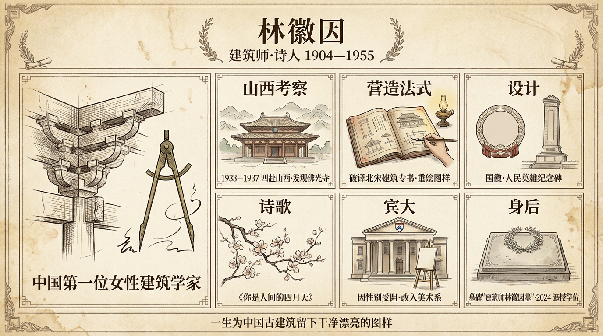

# 林徽因

> 繁体版：[林徽因](https://github.com/j3ffyang/history/blob/main/docs/260804-linhuiyin-zh-hant.md)

谈起中国女性，林徽因是一个绕不开的名字。有人说，她是一个在飞翔的心灵，一个不屈服的灵魂，一个不断追求的人。

林徽因（1904年6月10日—1955年4月1日），本名林徽音，福建闽县人，生于浙江杭州，中国近现代建筑学家、作家、诗人，被称为中国第一位女性建筑学家。她与丈夫梁思成一道，为中国建筑史研究奠基；又参与中华人民共和国国徽、人民英雄纪念碑等设计。[¹][²]

## 一、家世与早年

林徽因初名"徽音"，出自《**诗经·大雅·思齐**》"**大姒嗣徽音，则百斯男**"——"徽音"即美誉；这两句咏的是周室母仪，说周文王之妻大姒（tài sì）承继先妣的美名。后来为了不与一位遭鲁迅批评的男作家"林微音"相混，她改名"徽因"。[¹]

她出身名门：祖父林孝恂是光绪十五年进士，曾资助蒋百里赴日留学；父亲林长民是学者，曾任郭松龄部队的秘书长，1925年死于战事；堂叔林觉民是黄花岗七十二烈士之一。[¹]

1916年，她入北京培华女子中学读书。1920年，随父旅居伦敦；在伦敦，一位做建筑师的女房东引她对建筑发生兴趣，她也在这里结识了诗人徐志摩，从此对诗歌与文学发生浓厚兴趣。[¹][²] 1921年回国；1923年参与新月社的活动；1924年，印度诗人泰戈尔访华，她与徐志摩一同担任翻译，并陪同游览北京。[²]

## 二、绘画与设计

林徽因的"画"，更多落在设计上。1924年，她与梁思成同赴美国宾夕法尼亚大学：她想读建筑，可宾大建筑系当时不收女生（据宾大校方，该系直到1934年才招收女生[³]），她只得入读美术系（School of Fine Arts），却选修了建筑系的大部分课程，成绩常胜过同班男生，还做过建筑设计的助教；1927年2月，她以美术学学士毕业，随后又到耶鲁大学戏剧学院学习舞台美术。[²][³][⁴]

她的设计，最著名的是中华人民共和国国徽的深化方案（清华大学设计组）与人民英雄纪念碑底座的装饰纹样、花环浮雕；她还设计了八宝山革命公墓的主体建筑格局，并在1920年代末以"白山黑水"图案赢得东北大学校徽竞标。晚年，她为挽救濒于失传的景泰蓝工艺奔走，设计了一批新纹样。[¹][²]

## 三、建筑研究

1928年，林徽因与梁思成回国，一同创办东北大学建筑系。[¹][²] 1931年，她加入中国营造学社，自此与梁思成并肩走向田野：1930年至1945年间，两人考察了190个县的2738处古建筑。

1937年夏，他们在山西五台山发现佛光寺东大殿——一座唐代木构，打破了"中国境内已无唐代木构建筑"的成说。[²] 这也是两人一连串山西之行的顶点：梁林先后于1933、1934、1936、1937年"四赴山西"，考察了云冈石窟、华严寺、应县木塔、太原晋祠、五台山佛光寺等一批经典建筑。[⁵]

这几次山西之行，就紧挨着"七七事变"——全面抗战爆发的前夜：佛光寺短短一周的测绘刚收尾，卢沟桥的枪声便响了；林徽因是出了山，才从报上得知战争已经开始。[⁵][⁹]

抗战期间，她随营造学社辗转长沙、昆明，最后到四川李庄，在贫病中仍坚持研究。[²]

《营造法式》是北宋留下的建筑专书，文辞古奥，连受过训练的建筑师也难通读。中国营造学社的一大工程，就是把它"破译"出来：梁思成、林徽因走访、测绘、拍摄了唐宋以来的各处古建筑，再把古籍里难解的图样，用现代制图的手法重新绘出。[⁴][⁵][⁹]

她与梁思成合撰《平郊建筑杂录》，并为《中国建筑史》的写作整理了大量资料。1946年，她参与创办清华大学建筑系。[¹][²][⁴]

（作者私见）我最爱看林徽因手绘的建筑图样——无论是山西考察的测稿，还是《营造法式》的注释图：线条匀净、左右对称、一笔不苟，兼有古籍版刻的整肃与现代测绘的精确。画这些图的，是一个不到四十岁的中国女性；她把这些图留在了纸上，也留住了对本国古建筑的一份笃定——那些木构，屹立一千多年而不倒。这样一种美，是急不得的：唯有静下来、慢下来，才看得进去，想得明白，也消化得了。它无须谁来吹捧追捧，也不因无人喝彩而减色——它自己安静地说话。近百年后，翻开《营造法式》、看她的图，那种美仍像一条缓缓流淌的溪水，静静淌过，讲着一段又慢、又好看的故事。

她的佛光寺测稿今藏于中国文化遗产研究院、中国营造学社纪念馆，并在"栋梁"展中首次展出[⁷]；她1937年在佛光寺测绘经幢的留影，见[维基共享资源](https://commons.wikimedia.org/wiki/File:林徽因在五台山佛光寺测绘经幢.jpg)[⁶]；林徽因署"徽绘"的佛光寺诸测稿、《营造学社汇刊》的测绘图版，另见搜狐网的图集[⁸]。

## 四、著作与诗歌

林徽因的文学创作与建筑事业并行。她的新诗、散文、小说散见于《北京晨报》《新月月刊》《诗刊》等报刊，诗风温婉，多以日常情思、自然的静美与生命的坚韧为题；其中最为人熟知的一首，是《你是人间的四月天》，另有诗《笑》、小说《九十九度中》等。[²] 身后，她的文字由梁从诫、陈学勇等人编成《林徽因文集》《林徽因文存》《林徽因全集》等多种文集。[¹]

## 五、婚恋

1928年，林徽因与梁思成在加拿大结婚，此后二人同走古建筑考察之路，是事业与生活上的伴侣。[¹][²] 在伦敦，她结识诗人徐志摩，徐引她走上新诗之路；1931年11月19日，徐志摩为赶赴她的建筑讲座，从南京飞北平途中坠机身亡，她作《悼志摩》以寄哀思。哲学家金岳霖亦是她一生的挚友。[¹]

需要说明的是：徐志摩、金岳霖与林徽因之间的种种，后人多有演绎；本文只述可考之事，其余属传记与读者的读法，不作论断。

## 六、晚年与身后

1949年，林徽因参与中华人民共和国国徽的设计；1950年，她出任北京市城市规划委员会委员；1953年，围绕北京古城墙与牌楼的存废，她与主张拆除的一方发生激烈争论。[¹][²]

1955年4月1日，林徽因因肺结核久治不愈，病逝于北京同仁医院，葬于八宝山革命公墓。[¹][²] 她的墓碑由梁思成设计，刻着她为人民英雄纪念碑设计的花环；墓碑上只有七个字："建筑师林徽因墓"。[⁴]

## 生平时间线

林徽因一生的大关节，略如下列[¹][²]：

- 1904年 — 生于杭州。
- 1920年 — 随父旅居伦敦，结缘建筑与诗歌。
- 1924年 — 与梁思成赴美国宾夕法尼亚大学；同年泰戈尔访华，任翻译。
- 1927年 — 以美术学学士毕业；转赴耶鲁大学学舞台美术。
- 1928年 — 与梁思成结婚，回国创办东北大学建筑系。
- 1931年 — 加入中国营造学社；徐志摩卒。
- 1937年 — 发现五台山佛光寺东大殿；抗战起，辗转南迁。
- 1946年 — 参与创办清华大学建筑系。
- 1949年 — 参与国徽设计。
- 1955年 — 病逝于北京，葬八宝山。
- 2024年 — 宾大追授建筑学学士学位[³][⁴]。

## 余论：迟到的学位

2023年10月15日，宾大韦茨曼设计学院宣布，将在2024年5月18日的毕业典礼上，向林徽因追授建筑学学士学位，以纠正近百年前因性别而生的错误；2024年5月18日，院长弗里茨·斯坦纳把这份毕业年份写作"1927年"的学位证书，交到林徽因的外孙女于葵手中。[³][⁴]

只是，正如研究者所说，她在中国建筑与规划上的成就——古建筑考察、破解《营造法式》、文物保存、旧城保护——早已不必用一张文凭来定义。[⁴] 她与梁思成育有女儿梁再冰、儿子梁从诫；建筑师林璎（Maya Lin）是她的侄女。[¹][²]

（读者读法）把1924年宾大的拒收与1955年的墓碑并置，会听见一声耐人寻味的回声：建筑系当年以"不收女生"为由，把她挡在"建筑"门外；而她的墓碑上，只刻着"建筑师林徽因墓"七个字。一个机构当年不肯给予的名分，最后由一方石碑替她写下——直到2024年那纸迟到的学位证书，这声回响才算落定。[³][⁴]

## 引用来源

1. 林徽因，维基百科（中文），访问日期：2026-10-09
2. Lin Huiyin，维基百科（英文），访问日期：2026-10-09
3. Weitzman School of Design, University of Pennsylvania, "An Architectural Pioneer Receives Her Due"（2023年10月15日），访问日期：2026-10-09
4. 李照，《一百年后，林徽因获得了建筑学士学位》，新京报（2024年5月19日），访问日期：2026-10-09
5. 《梁思成林徽因对山西贡献有多大，这个文献展告诉你》，人民日报客户端山西频道（来源：山西日报，2024年6月24日），访问日期：2026-10-09
6. 《林徽因在五台山佛光寺测绘经幢》照片，维基共享资源（Wikimedia Commons），https://commons.wikimedia.org/wiki/File:林徽因在五台山佛光寺测绘经幢.jpg ，访问日期：2026-10-09
7. 《林徽因测绘佛光寺测稿等文献首次展出》，中国新闻网，2024年6月29日，https://www.chinanews.com.cn/cul/2024/06-29/10243000.shtml ，访问日期：2026-10-09
8. 《1937年，建筑师林徽因的佛光寺测稿——中国文化遗产研究院藏营造学社档案撷珍》，搜狐网（"藏书老王"，撰稿人永昕群；资料图集，非权威来源），2024年6月3日，https://www.sohu.com/a/783469242_121124715 ，访问日期：2026-10-09
9. 《梁思成、林徽因展，神仙感情的B面》，澎湃新闻（武汉市文化和旅游局），2021年10月21日，https://m.thepaper.cn/baijiahao_15004212 ，访问日期：2026-10-09
