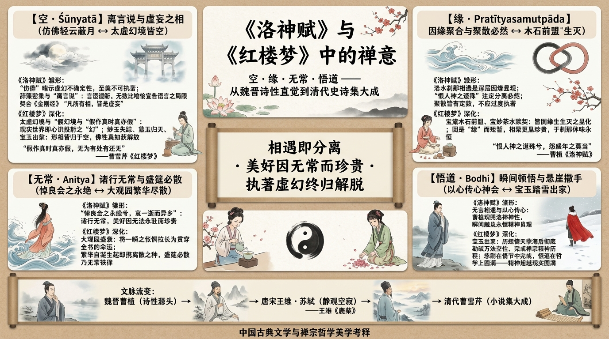

# 《洛神赋》与《红楼梦》中的禅意——空、缘、无常与悟道

> 本文是《[洛神赋：魏晋美学的永恒传承与《红楼梦》的深层对话](260629-luoshenfu-literary-analysis.md)》的姊妹篇。那篇长文讨论两部作品在女性形象、悲剧结构与美学层面的千年对话；本文则把其中禅宗哲学的维度单独抽出，集中考察"空、缘、无常、悟道"这四个概念如何在两部作品中层层深化。

## 导言

当我们将禅宗的哲学镜鉴照向《洛神赋》，才会悟到：*相遇即分离，美好因无常而显得更为珍贵；执著于虚幻之物而不得，正是通往精神解脱的必经之路*。

这一视角并非凭空叠加。《洛神赋》中如梦似幻的相遇，《红楼梦》中由盛转衰的大观园，本身就为这种解读提供了充分的文本基础。以下依次展开四个层面：**空**（Śūnyatā）、**缘**（Pratītyasamutpāda）、**无常**（Anitya）与**悟道**（Bodhi）——四个概念皆在《洛神赋》中现其雏形，而在《红楼梦》中获得情节化、体系化的深化。

## 第一部分：《洛神赋》——禅意的雏形

魏晋之世是中国历史上的"精神觉醒"时代：汉末动荡之后，士人转而向内寻求精神的超越——长文已详述老庄之学与道教信仰如何塑造了这一时代氛围。这里要补充的是同一精神气候的另一面：早期的佛教思想也开始对中国知识精英产生影响，为日后禅宗的诞生埋下种子。曹植正是在这样的精神气候中写作的。

### 刹那相遇："忽然"的美学

《洛神赋》的序文记述，曹植在洛水之上，忽然看到了一位神女。这一"忽然"相遇的设置，本身就暗示了一种"顿悟"式的刹那性——美与真不以渐进的方式呈现，而是在电光石火的一瞬整体涌现。这与后来禅宗"顿悟"的美学有隐秘的内通。

### 辞藻的密集与"离言说"

长文已经指出，赋文以排比、对仗、比喻的密集堆叠构成其修辞特色。这里关心的是另一层含义：这种堆叠最终指向的不是华美，而是语言本身的失效。

这正是禅宗"离言说"的思想底色。禅宗强调"言语道断""不立文字"，认为真理无法通过语言完全表述。曹植用无数比喻逼近洛神，每一个比喻却又在宣告自身的不足——诗人在无意间，提前触到了后来禅门以机锋与沉默应对的那个困局。

### 美的易逝性与无常之悲

洛神的形象中，隐含着一种**无常的悲感**：

> 悼良会之永绝兮，哀一逝而异乡。

曹植遇见了这样一位完美的女性，相聚的时刻却短促如一瞬。长文已将这种"相遇即分离"的结构，读作后世文学反复回响的原型；而换上佛家的眼光，同一句诗所呈现的正是"诸行无常"：**美好并非碰巧短暂，它的价值本身就建立在短暂之上**——正因为留不住，这一次相遇才显得如此珍贵。

### 原文中"空"的意蕴

《洛神赋》的整个叙述框架中，充满了对虚幻性的暗示：

- 洛神本身是否存在，文中含糊其辞
- 相遇的过程是如梦似幻的
- 分离的后果是对虚幻性的最终确认

曹植从最开始就在暗示观者：这个女性可能是幻觉、梦想、或者对美的理想化投射。她"仿佛兮若轻云之蔽月"——这个"仿佛"是关键词，它暗示了一种不确定性、虚幻性。

洛神被描写得如此具体、如此华丽，但正是这种具体性本身暴露了她的虚幻。每一个比喻都在试图定义她，但每一个比喻都失败了，最终只能承认：**她是不可定义的、不可执著的**。这与禅宗经典《金刚经》"凡所有相，皆是虚妄"的旨趣遥相呼应——不是说世界不存在，而是说一切形相都无有自性，无法被绝对固定地界定。

### 相遇的必然性与分离的必然性

曹植与洛神的相遇不是随机的，而是一种"缘"的显现。他们在特定的时间、特定的地点相遇，这说明了一种更深层的因缘关系。但同样地，这种相遇也注定了分离的必然。

禅宗对"缘"的理解是：所有的现象都是因和缘的组合。因缘聚合则相遇，因缘散开则分离。最重要的是，要认识到这种聚与散都有其必然性，而不应过度执著。

### 瞬间悟道：无言的精神相通

曹植与洛神的相遇是一个"瞬间"的相通。在这个瞬间，他们之间没有言语，但有着深刻的精神默契。这种瞬间的、无言的相通，正是禅宗所说的"顿悟"或"以心传心"。

《洛神赋》中写"恨人神之道殊兮，怨盛年之莫当"，曹植通过对洛神的观照，似乎触及到了某种永恒的精神真理。这不是一般的感情作用，而是一种精神的"开悟"。

## 第二部分：《红楼梦》——禅宗思想的深化

如果说《洛神赋》只是无意间触及了这些主题，那么《红楼梦》则是有意识地将其编织进全书的骨架。小说开篇的神话设定——石头成精、女娲补天、绛珠仙草——本身就是在一个"幻"的框架内展开叙事。

### "空"的具体化

《红楼梦》中的"空"不仅是哲学观念，而是被具体化为情节与意象：

- 大观园虽然存在，但它是"幻"的
- 诸女性虽然鲜活，但她们都在"幻"中
- 宝玉与黛玉之间的爱虽然真挚，但也无法超越虚幻的本质

妙玉最后的失踪，黛玉最后的"魂归离恨天"，宝玉最后的出家（以上均见今本后四十回；脂评本仅存前八十回）——这些都是对"空"的终极诠释。所有的形相都消失了，但精神本身（在禅宗意义上的"佛性"或"真如"）则得到了解放。

### "幻"字的深层含义

《红楼梦》以"幻"字为中心架构。"太虚幻境""假作真时真亦假"——整部小说的情节都在不断强化这种虚幻的意蕴。

这个"幻"字的立意，与禅宗的"空""幻"观相通。在禅宗看来，现实世界本身就是"幻"的，是心识的投射。认识到这一点，反而成为了精神解脱的第一步。

曹雪芹通过将整部小说的现实设定为"幻"，暗示了一个深刻的哲学命题：*所有发生在大观园中的悲欢离合，所有看似"真实"的人物关系与情感纠葛，本质上都是心灵的映像*。

### 爱情的因缘性

宝玉与黛玉、宝玉与妙玉之间的种种互动，都被设定为"缘"的表现。他们的相知、相惜，以至最后的分离，都遵循了"因缘生灭"的法则。

这种爱情正是因为是"缘"的产物，而不是命定的、绝对的，所以才显得更加珍贵。当我们明白所有的相聚都源于因缘，所有的分离也源于因缘，我们就不会过度哀伤分离，而是学会了在短暂的相聚中感受永恒的精神价值。

### 大观园的衰落：无常的法则

大观园由盛转衰的过程，长文已从美学层面详作分析。在佛家的视野里，它展示的是"无常法则"的完整形态：繁华不是被偶然摧毁的，而是从诞生起就携带着离散的种子。《红楼梦》由此把《洛神赋》在一瞬之间体会到的怅惘，拉长为贯穿全书的命运。

大观园的女儿们虽然年轻、美丽、智慧，但她们的衰落与离散是必然的。这不是一个悲观的观点，而是对"无常法则"的深刻认识：诸女性虽然离散了，但她们在大观园中的美好时刻却因为是无常的、短暂的，而显得更加永恒。

### 出家与"顿悟"的完成

宝玉最终出家，可以理解为他"顿悟"的最后完成。他在经历了对黛玉的爱、对妙玉的精神相通、对大观园的繁华与衰落的观察之后，最终明白了"一切皆空""因缘生灭"的真理，因此选择了出家。

这一结局虽然在故事层上是悲剧的，但在哲学层面上则是"悟道"的完成。宝玉在《红楼梦》的世界中经历了一种"禅宗的精神历程"：从对现实的执著，到对精神的追求，再到最后对万法空性的认识与接纳。

## 第三部分：两书的对话——从洛神之逝到宝玉出家

长文的结语已分别给出两部作品的答案：一首诗的怅惘，一部长篇小说的确认。本文要补充的是第三种声音——禅宗哲学为这场跨越千年的对话提供的最终解释：认识到所有的形相都是虚幻的，所有的相遇都因缘生灭，所有的美好都无常易逝，反而成为了精神的最高解脱。

## 第四部分：禅学诠释的边界

有学者质疑：魏晋时期禅宗尚未成形，如何能说《洛神赋》包含禅学思想？这是一个有效的问题。但应该理解的是，禅宗的思想基础——佛教的"空性""无常"等观念——早已传入中国；而且，禅宗本身就是中国士人精神与佛教思想融合的产物。

因此，更准确的表述是：《洛神赋》包含的是"禅学的精神源头"，而非成熟的"禅宗思想"。本文所论的，正是这条思想线索如何从曹植的诗性直觉出发，最终在曹雪芹那里获得小说化的完成。

## 第五部分：旁证——王维、苏轼与《洛神赋》的精神共鸣

后世深受禅学浸润的诗人与《洛神赋》美学取向之间的共鸣，可以从侧面印证这一精神线索的绵延。

王维（701–761），名与字均取自《维摩诘经》，后世尊为"诗佛"。他的诗中反复出现"空"字——如"空山不见人""空山新雨后"——以静观与空寂为审美底色。这种以虚静观照万象的方式，与《洛神赋》以幻笔写至美的取向遥相呼应。

苏轼（1037–1101）一生与僧侣交游密切、熟稔禅理，其诗文常在繁华意象背后透出空幻之叹。他对"美好难驻、知音难守"一类主题的持续关注，正延续了从《洛神赋》到《红楼梦》的美学对话。

## 参考文献

### 佛教与禅宗典籍
- 《坛经》（慧能）
- 《景德传灯录》
- 《金刚经》

### 美学与理论研究
- 冯友兰《中国哲学史》（禅宗部分）
- 王维诗集、苏轼诗文集（通行整理本）

---

**撰写说明**：本文由《洛神赋：魏晋美学的永恒传承与《红楼梦》的深层对话》（`docs/260629-luoshenfu-literary-analysis.md`）中禅宗维度的内容独立而成，按"空—缘—无常—悟道"四层重新组织；《洛神赋》《红楼梦》的文本细节与人物分析请参见该长文。

全文约 3,000 字。
