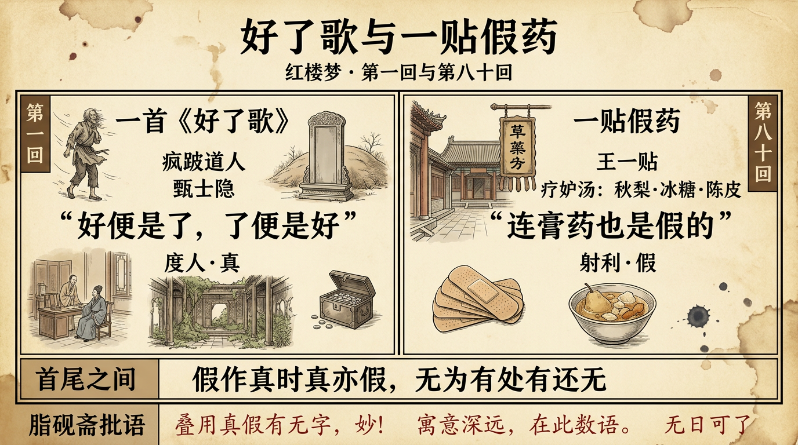

# 好了歌与一贴假药：《红楼梦》第一回与第八十回

> 繁体版：[好了歌与一贴假药：《红楼梦》第一回与第八十回](https://github.com/j3ffyang/history/blob/main/docs/260921-hlm-ch1-ch80-zh-hant.md)

《红楼梦》现存脂评抄本止于八十回——凡以脂本为据的读者，读到第八十回，曹雪芹的原著便到此为止。第一回以一首《好了歌》点题；到了末回，却让一个卖假膏药的道士出场。两回都写"道士"：一个度人，一个骗人；一首歌，一贴药。本文由这两回的首尾对读，看全书"真""假"二字如何在开头与结尾各响一声。（"首尾对读"是本文的读法，非作者明言。）

## 一、第一回：一首《好了歌》

《红楼梦》第一回回目是"甄士隐梦幻识通灵　贾雨村风尘怀闺秀"[¹]。这一回先借"作者自云"点出全书写法："因曾历过一番梦幻之后，故将真事隐去，而借通灵之说，撰此《石头记》一书也"，又"何为不用假语村言，敷演出一段故事来"[¹]。甄士隐（真事隐去）、贾雨村（假语村言）两个名字，正从这两句里化出。甄士隐午梦中所见的太虚幻境牌坊，两边一副对联：

> 假作真时真亦假，无为有处有还无。[¹]

**脂砚斋**在甲戌本上批这副对子："叠用真假有无字，妙！"[³] 开篇便把"真""假"并举，脂批一点即破。

后来甄家败落、女儿英莲走失，士隐贫病交攻。一日拄拐到街前散心，来了一个疯跛道人，口内念着几句言词——那就是《好了歌》[¹]：

> 世人都晓神仙好，惟有功名忘不了；古今将相在何方，荒冢一堆草没了。
> 世人都晓神仙好，只有金银忘不了；终朝只恨聚无多，及到多时眼闭了。
> 世人都晓神仙好，只有娇妻忘不了；君生日日说恩情，君死又随人去了。
> 世人都晓神仙好，只有儿孙忘不了；痴心父母古来多，孝顺子孙谁见了。[¹]

道人随即点破歌名与歌意："世上万般，好便是了，了便是好。若不了，便不好，若要好，须是了。我这歌儿，便名《好了歌》。"[¹] 甄士隐本有宿慧，"一闻此言，心中早已彻悟"，便为它作了一篇解注——"陋室空堂、当年笏满床，衰草枯杨、曾为歌舞场……乱哄哄你方唱罢我登场，反认他乡是故乡；甚荒唐，到头来都是为他人作嫁衣裳。"（"笏"读 hù，即朝笏。）[¹] 说毕，甄士隐笑一声"走罢"，"将道人肩上褡裢抢了过来背着，竟不回家，同了疯道人飘飘而去"[¹]（"褡裢"读 dā lian，一种布制长口袋）。**脂砚斋**在甲戌本上眉批叹道："'走罢'二字真悬崖撒手，若个能行？"[³]

## 二、第八十回：一贴假药

第八十回是脂评抄本的末回，回目因版本而异：庚辰本、列藏本无回目；戚序本、王府本、杨藏本作"懦弱迎春肠回九曲　姣怯香菱病入膏肓"；梦觉本、程甲本作"美香菱屈受贪夫棒　丑道士胡诌妒妇方"（程甲本"丑道士"作"王道士"）；舒序本仅存目录，作"夏金桂计用夺宠饵　王道士戏述疗妒羹"。[²] 无论依哪一个版本，这一回都绕不开几个人：受尽折磨的香菱、回娘家哭诉的迎春，和一个卖假药的"王道士"。

那日贾宝玉随人出西城，到天齐庙烧香还愿。"这老王道士专意在江湖上卖药，弄些海上方治人射利"，庙外卖着"丸散膏丹"，因膏药据说"一贴百病皆除"，人送浑号"王一贴"。[²] **脂砚斋**也看出这种"道士成对"的写法，庚辰本夹批："王一贴又与张道士遥遥一对，特犯不犯。"[³] 那"张道士"是第二十九回清虚观打醮出场的老道士，贾母口中的"老神仙"[⁴]。宝玉问他膏药到底治什么病，王一贴先吹得天花乱坠；宝玉再问"可有贴女人的妒病方子没有"，王一贴便胡诌出一味"疗妒汤"：

> 用极好的秋梨一个，二钱冰糖，一钱陈皮，水三碗，梨熟为度，每日清早吃这么一个梨，吃来吃去就好了。[²]

秋梨、冰糖、陈皮，其实只是一碗甜汤。被宝玉质疑未必见效，王一贴索性把底揭了："吃过一百岁，人横竖是要死的，死了还妒什么！那时就见效了。"[²] 临了更直说：

> 连膏药也是假的。我有真药，我还吃了作神仙呢。有真的，跑到这里来混？[²]

**脂砚斋**（庚辰本双行夹批）于此只留下一句断语："寓意深远，在此数语。"[³]

"告知"——王一贴在这一回里最要紧的一句话，竟是一句自曝其假的真心话。而"妒"是这一回真正的底色：夏金桂折磨香菱，给她改名"秋菱"；薛蟠又抄起门闩毒打，香菱终成"干血之症"；迎春也回娘家哭诉孙绍祖的暴虐。[²] 一贴治不了妒的假药，罩着一院子解不开的妒。

## 三、首尾之间：真与假的呼应

把两回收在一处看，有一种首尾的对称（本文的读法）：两个道士，都在"告诉"。第一回的跛足道人告诉甄士隐的，是"好便是了，了便是好"的彻悟；第八十回的王道士告诉贾宝玉的，先是天花乱坠的假药，末了才吐出一句真话——"连膏药也是假的"[¹][²]。一个以真度人，一个以假射利。

《红楼梦》开篇即说"将真事隐去""用假语村言"，太虚幻境那副"假作真时真亦假"的对联，把"真""假"并举[¹]。到了第八十回，王一贴一句"连膏药也是假的"，像把这两个字又轻轻点了一次：满口的膏药是假的，王一贴的"真药"是虚的，连"妒"这件最放不下的心事，也被一碗甜汤消解成笑谈。两回都以道人的"告诉"作结，只是一真一假，遥相照应。（这一层对称，仍是本文的读法，非作者明言。）

更巧的是，**脂砚斋**读甄士隐的解注时，接连几条眉批几乎都落在"不了"二字上：说场面兴败"已见得反覆不了"，说妻妾恩怨"缠绵不了"，说富贵嗜欲"贪婪不了"，说儿女筹划"痴心不了"，说功名争夺"喜惧不了"，最后总收一句"此幻事扰扰纷纷，无日可了"。[³] 一首劝人"了"的歌，批语却句句看见"不了"——与第八十回那贴治不了"妒"的假药，正好遥遥相对。

## 余论

若说第一回的《好了歌》是"看破"——功名、金银、娇妻、儿孙，好便是了；那么第八十回的一贴假药，便是"看不破"——妒、恨、痴、怨，一样都还没有了。曹雪芹原著的八十回，就停在这样一个"还没有了"的地方：香菱的病没有好，迎春的苦没有头，王一贴的假膏药还挂在庙外。开头那首劝人"了"的歌，与结尾这贴治不了"妒"的药，恰把"真"与"假"、"了"与"不了"，一前一后地摆在了读者面前。

## 引用来源

- 曹雪芹《红楼梦》第一回——回目"甄士隐梦幻识通灵　贾雨村风尘怀闺秀"；"作者自云……故将真事隐去……何为不用假语村言"；太虚幻境对联"假作真时真亦假，无为有处有还无"；《好了歌》四首及道人"好便是了，了便是好"之语；甄士隐解注"陋室空堂、当年笏满床……"及"同了疯道人飘飘而去"，维基文库，访问日期：2026-10-09
- 曹雪芹《红楼梦》第八十回——回目异文（庚辰本、列藏本无回目；戚序本、王府本、杨藏本"懦弱迎春肠回九曲　姣怯香菱病入膏肓"；梦觉本、程甲本"美香菱屈受贪夫棒　丑道士胡诌妒妇方"，程甲本"丑道士"作"王道士"；舒序本"夏金桂计用夺宠饵　王道士戏述疗妒羹"）；天齐庙、王一贴卖药及其浑号；宝玉问妒病、疗妒汤（秋梨、冰糖、陈皮）；"连膏药也是假的"；香菱改名秋菱、干血之症；迎春哭诉孙绍祖之恶，维基文库，访问日期：2026-10-09
- 《脂砚斋重评石头记》第一回、第八十回——第一回太虚幻境对联甲戌夹批"叠用真假有无字，妙！"；甄士隐解注甲戌眉批"反覆不了""缠绵不了""贪婪不了""痴心不了""喜惧不了""无日可了"诸条，及"'走罢'二字真悬崖撒手，若个能行"；第八十回庚辰双行夹批"王一贴又与张道士遥遥一对，特犯不犯""寓意深远，在此数语"，维基文库（合成庚辰、己卯、甲戌等本），访问日期：2026-10-09
- 曹雪芹《红楼梦》第二十九回——回目"享福人福深还祷福　痴情女情重愈斟情"；清虚观打醮，张道士出场（当日荣国府国公替身，掌道录司印），贾母称之为"老神仙"，维基文库，访问日期：2026-10-09
