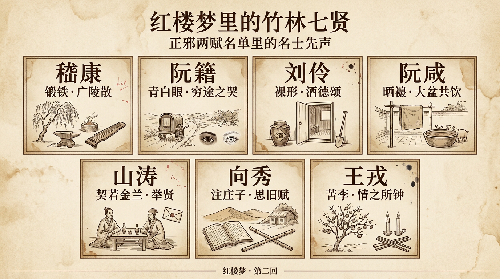

# 紅樓夢裡的竹林七賢

> 簡體版：[紅樓夢裡的竹林七賢](https://github.com/j3ffyang/history/blob/main/docs/260922-hlm-seven-sages-zh-hans.md)

《紅樓夢》第二回，賈雨村與冷子興在村肆裡對飲閒談，話題轉到賈寶玉。賈雨村忽而厲色，說出一番"正邪兩賦"（即天地正、邪二氣賦人之論）的高論，並報出一長串名字——許由、陶潛、阮籍、嵇（jī）康、劉伶……他斷言，賈寶玉就是"這一派人物"。這份名單裡，阮籍、嵇康、劉伶三人，正是"竹林七賢"的成員。蔣勳在《蔣勳細說紅樓夢》裡一再提醒讀者：要讀懂賈寶玉，先要讀懂這份名單背後的"名士"傳統。[¹²]

## 一、第二回：正邪兩賦裡的三個名字

賈雨村的理論是：天地生人，除了"大仁""大惡"兩種，餘者皆無大異；清明靈秀之氣與殘忍乖僻之氣偶相搏擊，秉此氣而生的人——

> 置之於萬萬人中，其聰俊靈秀之氣，則在萬萬人之上，其乖僻邪謬不近人情之態，又在萬萬人之下。若生於公侯富貴之家，則為情痴情種；若生於詩書清貧之族，則為逸士高人……[¹]

他隨即舉例：

> 如前代之許由、陶潛、阮籍、嵇康、劉伶、王謝二族、顧虎頭、陳後主、唐明皇、宋徽宗、劉庭芝、溫飛卿、米南宮、石曼卿、柳耆卿、秦少游，近日之倪雲林、唐伯虎、祝枝山，再如李龜年、黃幡綽、敬新磨、卓文君、紅拂、薛濤、崔鶯、朝雲之流，此皆易地則同之人也。[¹]

這份名單，從隱士許由、陶潛，到詩人、畫家、亡國之君，再到藝人、名妓，是一份"性情中人"的譜系。其中阮籍、嵇康、劉伶，正是魏晉間"竹林七賢"的代表。賈雨村把寶玉歸入"情痴情種"一路，也就等於把寶玉，接在了這條名士譜系之後。

"竹林七賢"之名，見於《世說新語·任誕》：

> 陳留阮籍，譙國嵇康，河內山濤，三人年皆相比，康年少亞之。預此契者：沛國劉伶，陳留阮咸，河內向秀，琅邪王戎。七人常集於竹林之下，肆意酣暢，故世謂"竹林七賢"。[³]

## 二、脂硯齋怎麼講

脂硯齋在第二回的回前批裡，先把這一回的"主腦"點明：

> 此回亦非正文，本旨只在冷子興一人，即俗謂"冷中出熱，無中生有"也。其演說榮府一篇者……此即畫家三染法也。[²]

也就是說，冷子興不過是一條"引線"，借他的口先為讀者勾出一個榮府的輪廓。至於賈雨村那篇"正邪兩賦"的長論，脂批的態度是"略舉大概"——第二回寫到"應劫而生"的名單時，甲戌本有一條側批：

> 此亦略舉大概幾人而言。[²]

需要說明的是：就第二回而言，脂批並沒有為竹林七賢專門下批；它真正關心的，是這一回的"結構"與"寓意"。冷子興是虛敲旁擊，"正邪兩賦"是替寶玉"立案"。而點到寶玉那句"女兒是水作的骨肉，男人是泥作的骨肉"時，甲戌本側批讚一聲"真千古奇文奇情"，又另有一條眉批：

> 以自古未聞之奇語，故寫成自古未有之奇文。此是一部書中大調侃寓意處。蓋作者實因鶺鴒之悲、棠棣之威，故撰此閨閣庭幃之傳。[²]（"鶺鴒"讀 jí líng，"棠棣"讀 táng dì，皆喻兄弟。）

"鶺鴒"（即"脊令"）出自《詩經·小雅·常棣》——"脊令在原，兄弟急難"；"棠棣"亦出《常棣》"凡今之人，莫如兄弟"。脂批用"鶺鴒之悲、棠棣之威"，說的正是兄弟間的傷痛。有意思的是，這隻"鶺鴒"在《紅樓夢》裡也真的出現過：秦可卿出殯，北靜王水溶路祭，初見寶玉，便從腕上卸下一串念珠相贈——

> 此是前日聖上親賜鶺鴒香念珠一串，權為賀敬之禮。[¹³]

後來寶玉把這串"鶺鴒香念珠"轉贈黛玉，黛玉只說了一句"什麼臭男人拿過的！我不要他"，便擲而不取。[¹⁴] 一串以"兄弟"為名的御賜之物，由北靜王到寶玉、再到黛玉，終被擲還——脂批的"鶺鴒之悲"，在情節裡也有了一聲迴響。（這一層呼應，是讀者的讀法。）

在脂批看來，曹雪芹寫這群"情痴"，是有所寄託的。

## 三、寓意：寶玉是"這一派人物"

《紅樓夢》讓賈雨村把阮籍、嵇康、劉伶寫進"正邪兩賦"的名單，用意不在考證，而在"歸類"：賈寶玉不是"淫魔色鬼"，而是"情痴情種"——與竹林七賢同屬"易地則同之人"。竹林七賢的精神底色，嵇康一語言之："越名教而任自然。"[¹¹]他們不守世俗禮法，重真情，以"痴""癖"對抗"名教"。寶玉厭惡功名、不守禮法、對女兒一往情深，都可以從這條線上讀。七賢之中，王戎那句"聖人忘情，最下不及情；情之所鍾，正在我輩"[⁸]，更像為整部《紅樓夢》的"情"字下了註腳。（把寶玉接續到竹林七賢，是蔣勳與本文的讀法，非作者明言，詳見"關於解讀層次"。）

## 四、竹林七賢：七個人的故事

以下七段，分寫七賢。所據以《世說新語》為主，《晉書》卷四十九為輔，兩書互有詳略。

### 嵇康

嵇康是七賢裡最耀眼的一個。《世說新語·容止》寫他"身長七尺八寸，風姿特秀"，山濤形容他：

> 嵇叔夜之為人也，巖巖若孤松之獨立；其醉也，傀俄若玉山之將崩。[⁴]（"傀"讀 guī，"傀俄"形容傾頹的樣子。）

他一面是"美男子"，一面又"土木形骸，不自藻飾"（《晉書》），全不修邊幅。他愛在柳樹下打鐵。《世說新語·簡傲》記，鍾會帶著一隊名士來拜訪，嵇康只顧打鐵，"揚槌不輟，傍若無人，移時不交一言"；鍾會臨走，嵇康才問：

> 何所聞而來？何所見而去？[⁵]

鍾會答："聞所聞而來，見所見而去。"這一問一答，成了名士的招牌。他最終因呂安案被殺，臨刑仍神色不變，索琴彈了一曲《廣陵散》，嘆道：

> 《廣陵散》於今絕矣！[⁷]

### 阮籍

阮籍與嵇康齊名，脾氣卻更"怪"。《晉書》說他"能為青白眼"：見俗人用白眼，見好友才用青眼。他母親去世，嵇康的哥哥嵇喜來弔喪，阮籍翻了個白眼，嵇喜怏怏而去；嵇康帶著酒和琴來，阮籍才露出青眼。[¹¹]

阮籍心裡有塊壘，便一個人駕車漫無目的地走，走到沒有路了——

> 時率意獨駕，不由徑路，車跡所窮，輒慟哭而反。[¹¹]

這就是"窮途之哭"。母親下葬時，他蒸了一頭小豬、喝了兩斗酒，然後去訣別，只喊了一聲"窮矣"，便"舉聲一號，吐血數升"[¹¹]。鄰家有個未嫁而死的姑娘，他並不相識，也徑前往哭，"盡哀而還"[¹¹]。

### 劉伶

劉伶是七賢裡最"放"的一個。《世說新語·任誕》記：

> 劉伶恆縱酒放達，或脫衣裸形在屋中，人見譏之。伶曰："我以天地為棟宇，屋室為褌衣，諸君何為入我褌中？"[³]（"褌"讀 kūn，即褲子；維基文庫底本此字作"㡓"。）

他嗜酒如命，被妻子哭著勸戒，他便說須向鬼神發誓，讓妻子備下酒肉；跪下來祝告的卻是："天生劉伶，以酒為名。一飲一斛，五斗解酲。婦兒之言，慎不可聽。"[³][¹¹]（"斛"讀 hú，"酲"讀 chéng，指酒醉。）他出門常乘鹿車、帶一壺酒，讓人扛著鍤（chā，即鐵鍬）跟著，說"死便埋我"[¹¹]。這份"遺形骸"之放，是名士的極端。

### 阮咸

阮咸是阮籍的侄子。七月七日，道北的阮家富戶曬出滿院錦綺，阮咸卻用竹竿挑起一條粗布"犢鼻褌"（"犢"讀 dú；犢鼻褌即短褲，"褌"見前）晾在院中，別人奇怪，他說：

> 不能免俗，聊復爾耳！[³][¹¹]

諸阮聚飲，不用杯子，以大盆盛酒，圍坐而酌，連群豬湊過來喝，他們也"便共飲之"[¹¹]。他看上了姑姑家的胡婢，姑姑本說留下，臨走卻把人帶走了，阮咸"遽借客馬追婢，既及，與婢累騎而還"[¹¹]（"遽"讀 jù）。他"妙解音律，善彈琵琶"，後世一種琵琶即以"阮咸"為名。

### 山濤

山濤是七賢裡的"長者"。他與嵇康、阮籍一見如故，"契若金蘭"。山濤的妻子韓氏覺得丈夫與這兩人交情非比尋常，想見一面；山濤便留二人住下，備酒肉，韓氏夜裡"穿墉以視之，達旦忘反"（"墉"讀 yōng，指牆壁）。第二天山濤問二人如何，韓氏說：你的才致不如他們，只能靠"識度"與他們相交。[⁹]

山濤後來做官，想舉嵇康接替自己的選官之職，嵇康卻寫了一篇《與山巨源絕交書》，列出"必不堪者七，甚不可者二"，寧可"濁酒一杯，彈琴一曲"。[¹¹]

### 向秀

向秀是七賢裡的學者。他好《莊子》，"於舊註外為解義，妙析奇致，大暢玄風"，只有《秋水》《至樂》兩篇未註完便去世了。[¹⁰][¹¹] 他也愛跟著嵇康打鐵："康善鍛，秀為之佐，相對欣然，傍若無人。"[¹¹]

嵇康被殺後，向秀路過山陽舊居，聽見鄰人吹笛，"發聲寥亮"，想起從前同遊的朋友，寫下那篇短短的《思舊賦》。序裡說：

> 鄰人有吹笛者，發聲寥亮。追想曩昔遊宴之好，感音而嘆。[¹¹]（"曩"讀 nǎng，從前的意思。）

### 王戎

王戎是七賢裡最小的，也最"世俗"。他七歲時，和一群孩子看見路邊李樹結滿果子，別人都搶著去摘，只有他不動，說：

> 樹在道邊而多子，此必苦李。[⁷]

摘下來一嘗，果然是苦的。可長大後，他又吝嗇得可笑：《世說新語·儉嗇》記他"有好李，賣之，恐人得其種，恆鑽其核"，又說他"既貴且富……每與夫人燭下散籌算計"[⁶]。但也是這個王戎，說過七賢裡最動人的一句話。他的兒子死了，山簡去安慰，見他"悲不自勝"，說不過是"孩抱中物"，何至於此；王戎回答：

> 聖人忘情，最下不及情；情之所鍾，正在我輩。[⁸]

後來他做了大官，坐車經過當年與嵇康、阮籍一起喝酒的酒店，回頭對車上的人說：從前我和嵇叔夜、阮嗣宗就在這裡暢飲；自嵇康早夭、阮籍亡故，我便被世事牽絆——"今日視此雖近，邈若山河。"[⁸]（"邈"讀 miǎo，遙遠。）

## 關於解讀層次

本文所引《紅樓夢》正文據維基文庫，脂批據維基文庫《脂硯齋重評石頭記》；《世說新語》《晉書》引文亦據維基文庫。竹林七賢的軼事，主要見於《世說新語》與《晉書》，兩書互有詳略，本文擇其可據者；《世說新語》原文有劉孝標註，本文所引"青白眼""窮途之哭"等兼參《晉書》本傳。凡"寶玉接續竹林七賢""名士譜系"一類，均屬蔣勳與本文讀者的詮釋，非作者明言；文本事實（判詞式的名單、七賢軼事原文）與解讀意見，文中已儘量分開。蔣勳的觀點屬現代流行讀法，非考證結論。

## 餘論

這七個人，是七個不肯把自己交給世俗規矩的人：嵇康鍛鐵、阮籍慟哭、劉伶裸形、阮咸曬褲、向秀註莊、山濤舉賢、王戎鑽核。他們共同的一句話，是嵇康的"越名教而任自然"。而《紅樓夢》第二回讓賈雨村把阮籍、嵇康、劉伶寫進"正邪兩賦"的名單，又把賈寶玉歸入"情痴情種"一路——曹雪芹等於把寶玉，接在了竹林七賢的身後。寶玉的"鍾情"、厭棄功名、不守禮法，都可以從這條線上讀懂。蔣勳把這種讀法講得很動情：他說《紅樓夢》真正要寫的，是一群"青春"的人；而竹林七賢，正是他們遙遠的先聲。[¹²]（這自然是蔣勳與本文的讀法，不是曹雪芹的夫子自道。）

## 引用來源

- 曹雪芹《紅樓夢》第二回——回目"賈夫人仙逝揚州城　冷子興演說榮國府"；賈雨村"正邪兩賦"論及名單"許由、陶潛、阮籍、嵇康、劉伶……此皆易地則同之人也"，維基文庫，訪問日期：2026-10-05
- 《脂硯齋重評石頭記》第二回——回前批"此回亦非正文，本旨只在冷子興一人……"、甲戌側批"此亦略舉大概幾人而言"、甲戌側批"真千古奇文奇情"與甲戌眉批"以自古未聞之奇語，故寫成自古未有之奇文。此是一部書中大調侃寓意處。蓋作者實因鶺鴒之悲、棠棣之威，故撰此閨閣庭幃之傳"，維基文庫《脂硯齋重評石頭記》，訪問日期：2026-10-05
- 《世說新語·任誕》——"竹林七賢"之名的由來；"劉伶恆縱酒放達，或脫衣裸形在屋中……"；"天生劉伶，以酒為名……"；阮咸曬犢鼻褌"不能免俗，聊復爾耳"；諸阮大盆共飲、群豕來飲，維基文庫，訪問日期：2026-10-05
- 《世說新語·容止》——"嵇康身長七尺八寸，風姿特秀……"；山濤"巖巖若孤松之獨立，其醉也傀俄若玉山之將崩"，維基文庫，訪問日期：2026-10-05
- 《世說新語·簡傲》——鍾會訪嵇康，"康方大樹下鍛……揚槌不輟，傍若無人"，"何所聞而來？何所見而去？"；劉孝標註引"青白眼"事，維基文庫，訪問日期：2026-10-05
- 《世說新語·儉嗇》——"王戎有好李，賣之，恐人得其種，恆鑽其核"；"司徒王戎，既貴且富……每與夫人燭下散籌算計"，維基文庫，訪問日期：2026-10-05
- 《世說新語·雅量》——"嵇中散臨刑東市……索琴彈之，奏《廣陵散》……《廣陵散》於今絕矣！"；"王戎七歲……樹在道邊而多子，此必苦李"，維基文庫，訪問日期：2026-10-05
- 《世說新語·傷逝》——王戎"聖人忘情，最下不及情；情之所鍾，正在我輩"；王戎經黃公酒壚，"邈若山河"，維基文庫，訪問日期：2026-10-05
- 《世說新語·賢媛》——"山公與嵇、阮一面，契若金蘭"，山妻韓氏"夜穿墉以視之，達旦忘反"，維基文庫，訪問日期：2026-10-05
- 《世說新語·文學》——"向秀於舊註外為解義，妙析奇致，大暢玄風……唯《秋水》《至樂》二篇未竟而秀卒"，維基文庫，訪問日期：2026-10-05
- 《晉書》卷四十九（阮籍、嵇康、向秀、劉伶等傳）——"阮籍……能為青白眼……及嵇喜來弔，籍作白眼……喜弟康聞之，乃齎酒挾琴造焉"；"車跡所窮，輒慟哭而反"；"舉聲一號，吐血數升"；劉伶"死便埋我"；阮咸追婢、大盆共飲；嵇康《與山巨源絕交書》、臨刑"《廣陵散》於今絕矣"；向秀註《莊子》、作《思舊賦》"鄰人有吹笛者，發聲寥亮"，維基文庫，訪問日期：2026-10-05
- 蔣勳《蔣勳細說紅樓夢》——以"名士""青春"讀第五回與第二回，把賈寶玉與竹林七賢一路相看（現代流行詮釋），訪問日期：2026-10-05
- 曹雪芹《紅樓夢》第十四、十五回——秦可卿出殯，北靜王水溶路祭，初見寶玉，贈"前日聖上親賜鶺鴒香念珠一串"（回目"賈寶玉路謁北靜王"），維基文庫，訪問日期：2026-10-05
- 曹雪芹《紅樓夢》第十六回——寶玉以"北靜王所贈鶺鴒香串"轉贈黛玉；黛玉"什麼臭男人拿過的！我不要他"，"遂擲而不取"，維基文庫，訪問日期：2026-10-05
